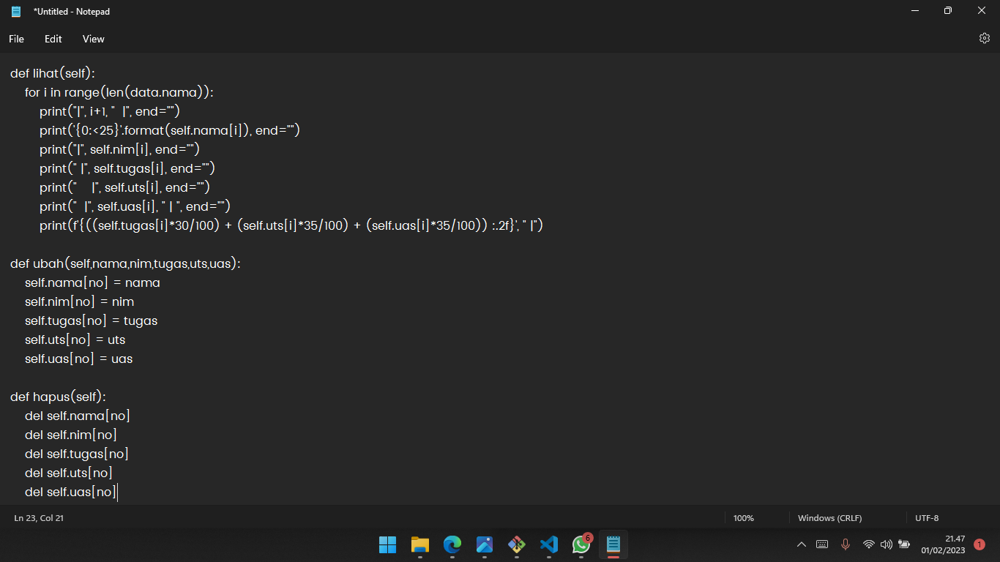
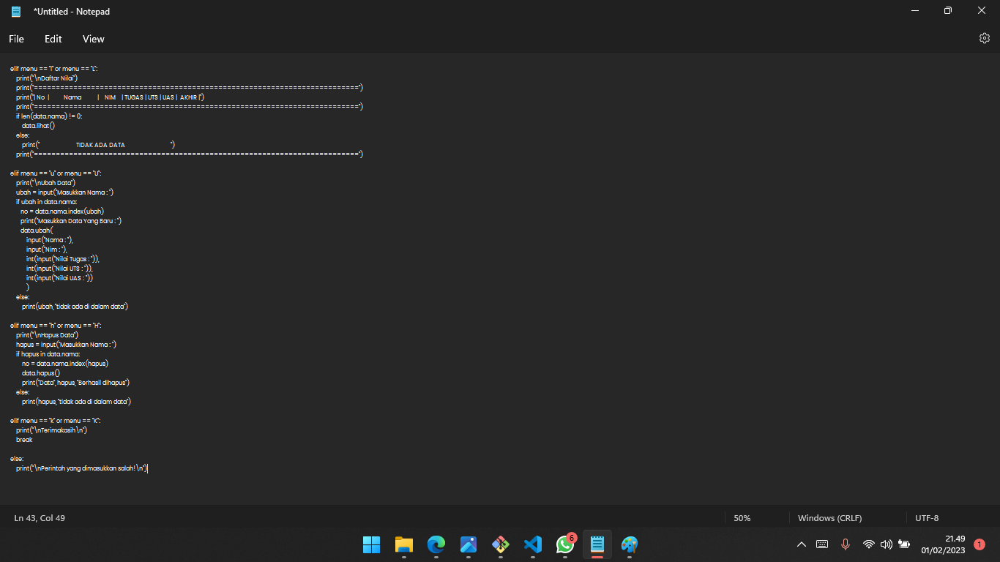
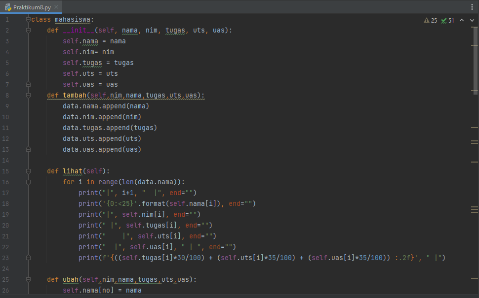
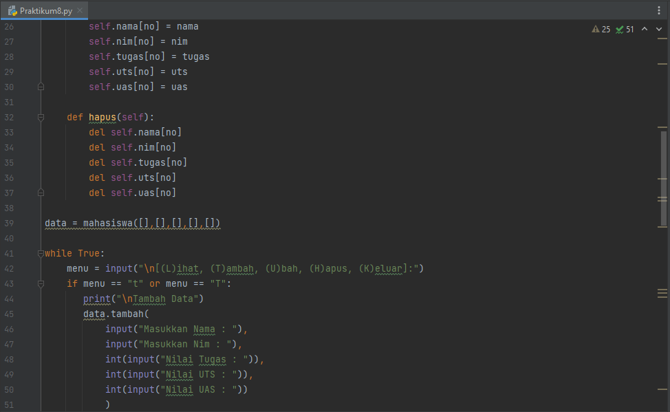
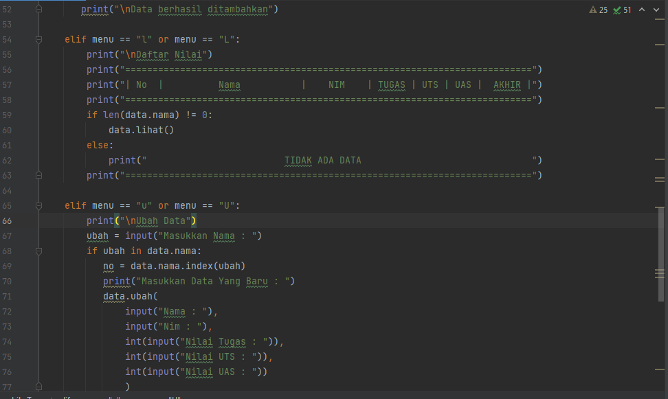
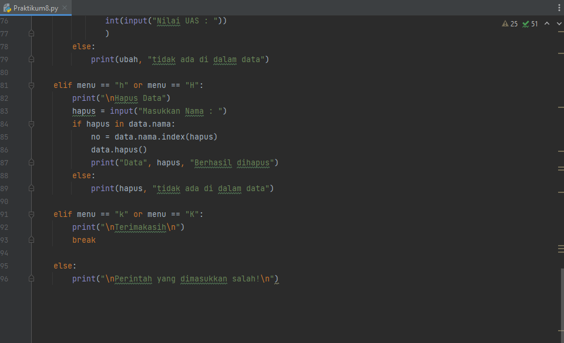
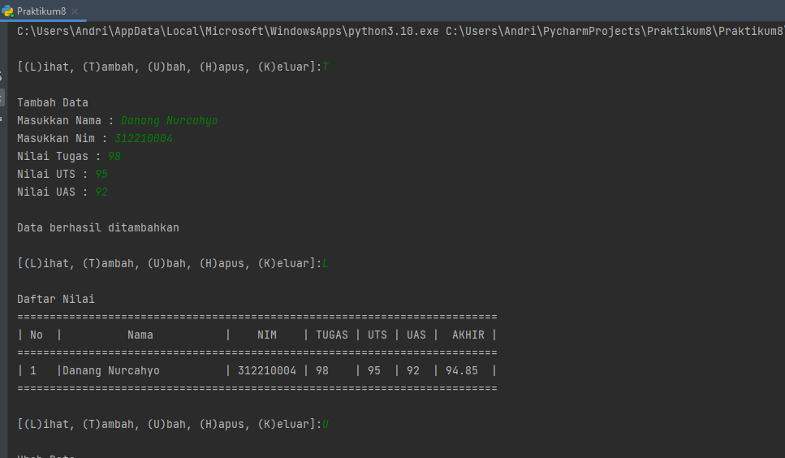
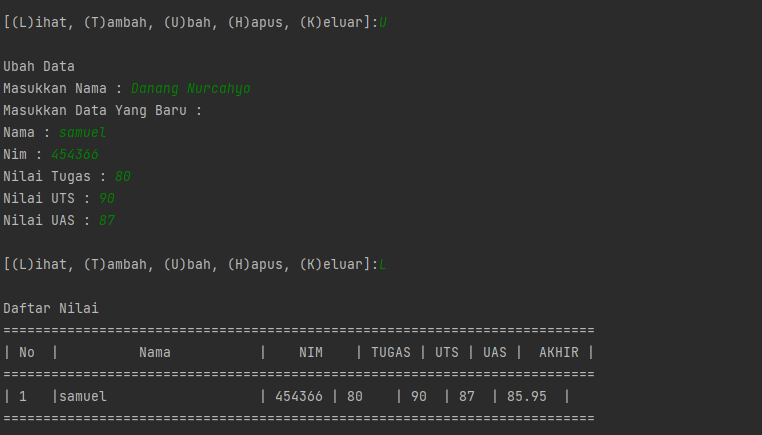
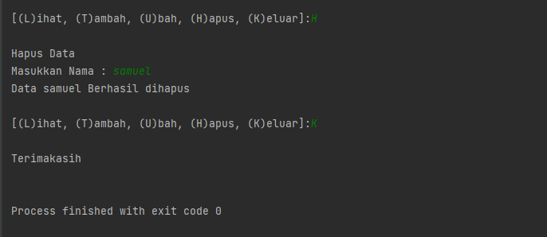

# Praktikum10

## Tugas pertemuan ke 12 Bahasa Pemrograman

## Nama : Ramadhan Ardi Iman Prakoso

## NIM : 312210722

## Kelas : TI.22.C.9

## Prodi : Teknik Informatika

## Tugas Praktikum 10
Buat program sederhana dengan mengaplikasikan penggunaan class. Buatlah class untuk menampilkan daftar nilai mahasiswa, dengan ketentuan:

Method tambah() untuk menambah data
Method tampilkan() untuk menampilkan data
Method hapus(nama) untuk menghapus data berdasarkan nama
Method ubah(nama) untuk mengubah data berdasarkan nama
Buat diagram class, flowchart dan penjelasan programnya pada README.md.
Commit dan push repository ke github.

### Rumus :
class mahasiswa: def init(self, nama, nim, tugas, uts, uas): self.nama = nama self.nim= nim self.tugas = tugas self.uts = uts self.uas = uas def tambah(self,nama,nim,tugas,uts,uas): data.nama.append(nama) data.nim.append(nim) data.tugas.append(tugas) data.uts.append(uts) data.uas.append(uas)

data = mahasiswa([],[],[],[],[])

while True: menu = input("\n[(L)ihat, (T)ambah, (U)bah, (H)apus, (K)eluar]:") if menu == "t" or menu == "T": print("\nTambah Data") data.tambah( input("Masukkan Nama : "), input("Masukkan Nim : "), int(input("Nilai Tugas : ")), int(input("Nilai UTS : ")), int(input("Nilai UAS : ")) ) print("\nData berhasil ditambahkan")

## Program :

## Hasil Run & Penjelasan Program :

Pertama kita mendeklarasikan sebuah class mahasiswa yang didalamnya terdapat atribut NIM, Nama, nilai tugas, nilai UTS dan nilai UAS. Jangan lupa, untuk mendeklarasikan sebuah class didalam OOP kita harus menggunakan def__init__ dan juga self.

### class mahasiswa:
###    def __init__(self, nama, nim, tugas, uts, uas):
###        self.nama = nama
###        self.nim = nim
###        self.tugas = tugas
###        self.uts = uts
###        self.uas = uas

Seperti biasa, deklarasikan satu dictionary kosong sebagai tempat menyimpan data-data yang sudah kita input. Ada 5 list kosong yang nantinya berisi NIM, Nama, nilai tugas, nilai UTS dan nilai UAS.

### data = mahasiswa([],[],[],[],[])  

Kita akan buat beberapa method untuk menambahkan, menampilkan, menghapus, mengubah data mahasiswa. Pertama membuat method tambah(), method ini berfungsi untuk menambahkan data. Dalam method ini kita menggunakan append() supaya data yang terakhir ditambahkan ada di urutan list paling akhir.

### def tambah(self,nim,nama,tugas,uts,uas):
###        data.nama.append(nama)
###        data.nim.append(nim)
###        data.tugas.append(tugas)
###        data.uts.append(uts)
###        data.uas.append(uas)

Ini tampilan jika kita menginput method : Tambah()

Fungsi membuat method lihat() yaitu untuk menampilkan seluruh data yang sudah kita tambahkan tadi. Jika tidak ada data sama sekali, maka akan muncul tulisan TIDAK ADA DATA.

### def lihat(self):
###         for i in range(len(data.nama)):
###             print("|", i+1, "  |", end="")
###             print('{0:<25}'.format(self.nama[i]), end="")
###             print("|", self.nim[i], end="")
###             print(" |", self.tugas[i], end="")
###             print("    |", self.uts[i], end="")
###             print("  |", self.uas[i], " | ", end="")
###             print(f'{((self.tugas[i]*30/100) + (self.uts[i]*35/100) + (self.uas[i]*35/100)) :.2f}', " |")

Ini tampilan jika kita menginput method : Lihat()

Fungsi membuat method ubah() yaitu untuk mengubah data. jika method ini diinput, maka data Nama, NIM, nilai tugas, nilai UTS, nilai UAS index nomor - (no) akan diubah sesuai dengan inputan dari user. Index ke - (no) akan dicari secara otomatis sesuai dengan nama yang ingin diubah oleh user.

### def ubah(self,nim,nama,tugas,uts,uas):
###         self.nama[no] = nama
###         self.nim[no] = nim
###         self.tugas[no] = tugas
###         self.uts[no] = uts
###         self.uas[no] = uas

Ini tampilan jika kita menginput method : Ubah()

Terakhir kita membuat method hapus(), yang berfungsi untuk menghapus data berdasarkan nama. Kita bisa menggunakan del untuk menghapus datanya. Seperti sebelumnya, nomor index list yang akan dihapus disesuaikan dengan inputan dari user. Yaitu index nomor ke - (no).

### def hapus(self):
###         del self.nama[no]
###         del self.nim[no]
###         del self.tugas[no]
###         del self.uts[no]
###        del self.uas[no]

Ini tampilan jika kita menginput method : Hapus()

# Diagram Class Praktikum 8

# Flowchart Praktikum 8

# Sekian dari saya, Terima kasih